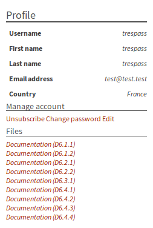
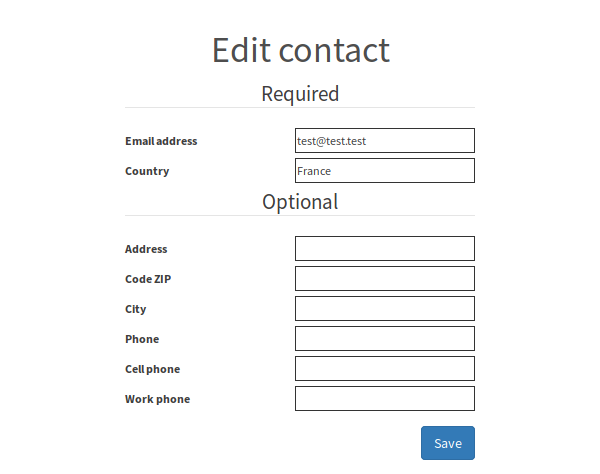

# OS information
OS type: Ubuntu Server 16.04.1

Username: trespass
Password: trespass

A SSH server is running so it eases the administration.

The IP of the machine is displayed on the console of the virtual machine. If no IP has been set (e.g. missing interface, no dhcp) a message is displayed, warning to check if an interface is set to the machine, or if the interface is on a network with a DHCP server.

# Change Keyboard mapping
The current keyboard mapping of the virtual machine is currently set to: **swiss french**

In order to change the mapping, please use following command:
**sudo dpkg-reconfigure keyboard-configuration**

# Importing the .ova file
The .ova file for the virtual machine is available here: [https://www.itrust.lu/trespass-enduser.ova](https://www.itrust.lu/trespass-enduser.ova)
We tested the import of the .ova file with VirtualBox v5.0.24.

# Links
## Virtualbox
See [https://www.virtualbox.org/manual/ch01.html#ovf](https://www.virtualbox.org/manual/ch01.html#ovf) for more information on how to import in VirtualBox.
Link to download VirtualBox: [https://www.virtualbox.org/](https://www.virtualbox.org/)

## ReCAPTCHA
See [https://www.google.com/recaptcha/intro/](https://www.google.com/recaptcha/intro/) for more information on reCAPTCHA

# Steps to setup and access the trespass services
1. Download ova file and save it on your disk;
1. Import the ova to your virtual machine system;
1. Check that the interface of the virtual machine is set to a host interface (bridge mode) connected to a network where a DHCP server is running;
1. Start the machine;
1. Wait for the logon console (The IP address of the machine should appears before the logon);
1. Log-on to the machine console using trespass as user and password (pay attention to the keyboard which is set to swiss french, you can change it as explained in **Change Keyboard mapping** section). 
1. Switch to root with sudo su (enter same session password), edit /home/trespass/trespass-docker/fe.env file with **nano /home/trespass/trespass-docker/fe.env**, and modify following environment variables for email notification and reCAPTCHA:  
RECAPTCHA_SECRET_KEY=**CAN BE LEFT EMPTY, IN THIS CASE RECAPTCHA IS DISABLED ON REGISTRATION. ACTIVATING RECAPTCHA (i.e. PUTTING A KEY) REQUIRES TO CHANGE THE DNS NAME OF FRONT-END. SEE XXX SECTION**  
RECAPTCHA_PUBLIC_KEY=  
SMTP_HOST=  
SMTP_PORT=  
SMTP_USERNAME=  
SMTP_PASSWORD=  
SMTP_AUTH_ENABLED=**PUT true IF SMTP SERVER MUST CHECK AUTH, false OTHERWISE**  
SMTP_STARTTLS_ENABLED=**PUT true IF SMTP USES STARTTLS, false OTHERWISE**  
1. Save your modification with **CTRL+O** and **Enter**
1. Quit nano with **CTRL+X**
1. Edit dnsvalue file with **nano dnsvalue**
1. Put the root DNS you want after equal sign in **NEW_DNS_VALUE=**  line (e.g. trespass.eu)
1. Save with **CTRL+O** and **Enter**
1. Quit nano with **CTRL+X**
1. Restart services of the platform with following command: **/etc/init.d/startContainers**
1. Wait for the end of the command
1. On your desktop or laptop machine, if under Windows, open notepad as administrator, then open following file: **c:\Windows\System32\Drivers\etc\hosts**; if under Linux, open following file as administrator: **/etc/hosts**; if under MacOS, open following file as administrator: **/private/etc/hosts**.
1. append the file with following lines (replacing IP_ADDRESS with the IP address from step 5, and DNS_VALUE with the root DNS you choose in step 11)  
IP_ADDRESS	DNS_VALUE  
IP_ADDRESS	cas.DNS_VALUE  
IP_ADDRESS	svn.DNS_VALUE  
IP_ADDRESS	arguesecure.DNS_VALUE  
IP_ADDRESS      interactor.DNS_VALUE  
IP_ADDRESS      redmine.DNS_VALUE  
IP_ADDRESS      tkblogs.DNS_VALUE  
1. You can access using your browser the front-end with the root DNS you choose in step 11. A default user (administrator) has been defined with following credentials:
Username: trespass
Password: Tresp@ss1
1. Click on **Edit** link in **Manage account** section:  

1. Click on **Edit contact** button:  

1. Edit **Email address** input with your email (so you will receive email on user registration), and click on **Save** button:  
